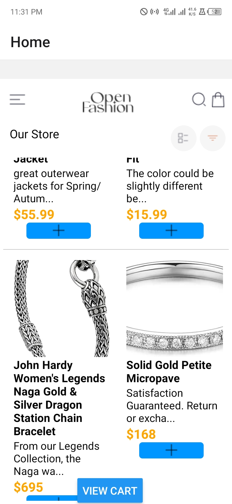
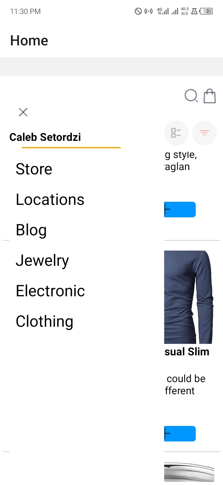
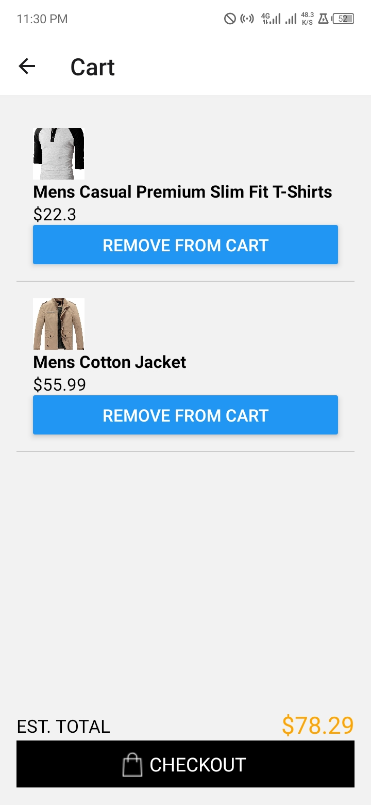

# rn-assignment7-11102684
## This is a Mobile Shopping Application
I used FlatList in react native to display products on the home screen. I used AsyncStorage to store the products added to and removed from cart. I used fetch() to get data from an external API which is the fake store API. Attached are the screenshots of the application.

## Screenshot

